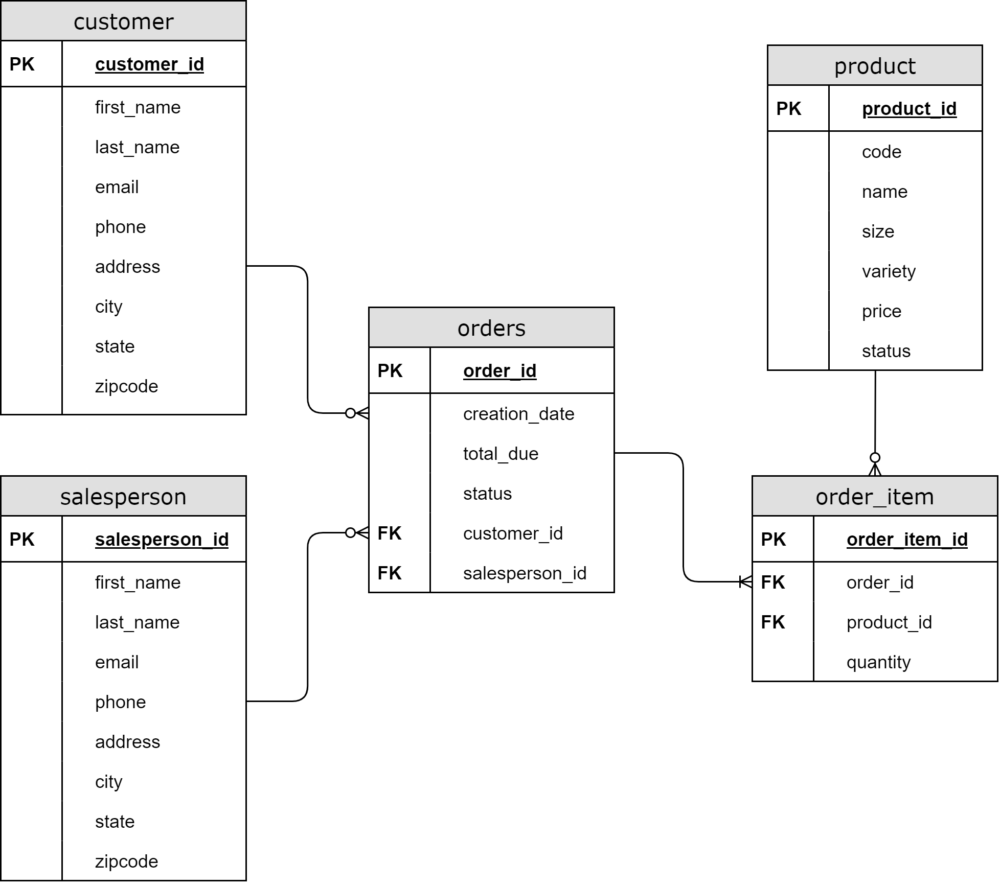

# Introduction
Developed a JDBC application that creates a connection in the dockerized PostgreSQL database and allows the client to access predefined select queries. Maven was used to compile and build the project with the necessary dependencies. 

# Implementaiton
## ER Diagram

## Design Patterns
### DAO (Data Access Object) Pattern
The Data Access Object pattern separates the business layer from the persistence layer through abstraction. Without exposing details of the underlying database, the user can create, read, update, and delete (CRUD) from the database through Data Transfer Objects (DTO). A benefit of using the DAO pattern is that changing business logic is simple as the same DAO interface can be reused. Furthermore, details of the implementation of the database are hidden from the rest of the application. A disadvantage is that it hides the true cost of the query from the developer. They may trigger multiple inefficient queries when accessing objects and tables.
### Repository Pattern
The Repository pattern focuses on single-table access per class and joins tables in code rather than in the database. Like the DAO pattern, the Repository Pattern is used to hide the details of how objects are retrieved and manipulated in the database. A benefit is that it allows the developer to access a single table rather than the entire database. However, this pattern may not be worth it if the database is already highly normalized. Joining in the database may be more efficient than joining in the code for this scenario.

# Test
Created tables and populated the database with mock data using SQL scripts. The queries were manually tested through the CLI before adding it to the code. Tested functionality of the findById method using the print statements inside of `JDBCExecutor`.
