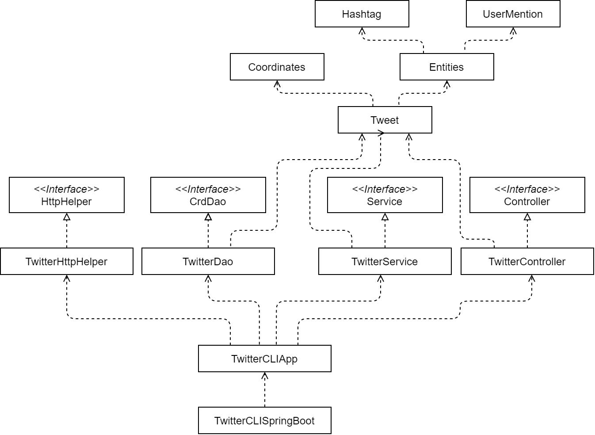

# Introduction

Developed a Java application that can post, show, and delete tweets using Twitter REST API. User
authenticated with the OAuth internet protocol by setting system environment variables for the
corresponding keys. Followed MVC and DAO design patterns to retrieve and send HTTP requests. Maven
was used for build automation, and the application was dockerized and uploaded to DockerHub.
Integration and unit testing were performed with Junit and Mockito.

# Quick Start

### Usage

- `post`: TwitterApp post tweet_text latitude:longitude
- `show`: TwitterApp show tweet_id [field1, field2, ..]
- `delete`: TwitterApp delete [id1, id2, ..]

### 1. Maven

Export the following environment variables

- `consumerKey`: API key
- `consumerSecret`: API Secret Key
- `accessToken`: Access Token
- `tokenSecret`: Access Token Secret

```
# build and compile package
mvn clean package

# run jar file
Java -jar -cp target/java_apps-1.0-SNAPSHOT.jar post|show|delete [options]
```

### 2. Docker

```
# pull image from docker registry
docker pull kelvin3094/twitter_app

# run with docker
docker run --rm \
-e consumerKey=”API Key” \
-e consumerSecret=”API Secret Key” \
-e accessToken=”Access Token” \
-e tokenSecret=”Access Token Secret” \
Kelvin3094/twitter_app post|show|delete [options]
```

# Design

## UML diagram



- ***TwitterCLIApp***: Functions as the main method. Processes command line arguments and retrieves
  system environment variables. Creates and chains necessary dependencies together to access the
  Controller class. Outputs the Tweet object in Json format.
- ***TwitterController***: Parses command line arguments and ensures that the arguments are in a
  valid format. Splits latitude and longitude values. Calls the correct methods
  from `TwitterService` to post, show or delete the Tweet.
- ***TwitterService***: Performs the business logic. Validates the given input (text length,
  parsable id, etc) according to the Twitter API guidelines. Calls corresponding post, show, delete
  method from the TwitterDao class if all checks are passed.
- ***TwitterDao***: Handles the HTTP requests and responses. Uses the `TwitterHttpHelper` class to
  execute post and get request. Parses the Json response body and returns a Tweet object from it.

## Models

A simplified version of Twitter's Tweet model was used to handle the http responses and requests.
The Tweet model depends on two other classes, coordinates, and entities. Properties of the Twitter
model include time created, number of retweets, and number of times favorited.

## Spring

Class dependencies are handled using the Spring framework. Previously, class dependencies were
initiated and chained together in the `TwitterCLIApp` class. This would be a problem if the number
of dependencies became too large, so Spring was used to prevent it. Annotations such as `@Component`
, `@Controller`, and `@Service` were used to indicate a bean and its
stereotype. `TwitterCLIComponentScan` automatically scans the project for beans and injects the
necessary dependencies. `TwitterCLISpringBoot` configures the `TwitterCLIApp` with Spring.

# Test

Performed integration and Unit testing using Junit 4. Used Mockito to create mock objects for
dependencies when unit testing. The mock objects were created whenever a method from the tested
class called a method from a different class. This was done to make sure that the dependencies did
not affect how the class functioned. Integration testing was done to confirm that the application
works correctly as a whole.

## Deployment

Created a docker file with the commands to assemble the image. Ran maven to package and test the
Java application. Built the docker image locally using `docker build -t kelvin3094/twitter_app` and
checked that it worked correctly. Finally, pushed the image to Docker Hub.

# Improvements

- Implement the complete version of the Tweet model
- Search for tweets given a regex instead of just id
- Allow for retrieval of multiple tweets
