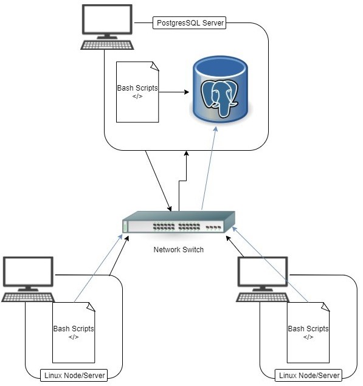

# Introduction
Developed a cluster monitoring system that records hardware specifications and resource usage of each node/server in the system. The script is used by the Jarvis Linux Cluster Administration (LCA) team to monitor and manage their Linux cluster which is currently running on CentOS 7. The data is collected from the host machine every minute using crontab and is stored on a Relational Database Management System using PostgresSQL. Data collected include CPU mode, memory free, disk io, CPU number, etc. A few SQL queries were written to answer basic business questions. The queries can find the average memory used for each host over a specified time interval and detect server failures. Bash scripts are used to create, stop or start the PSQL Docker instance and to insert into the database. Used git as a version control system and followed the GitFlow workflow ideologies to manage branches and features. 

# Quick Start
- Start a psql instance using `psql_docker.sh`
````bash
    ./scripts/psql_docker.sh create [db_username] [db_password]
````
- Create hardware usage and hardware specifications tables using `ddl.sql`
````bash
    psql -h localhost -U postgres -d host_agent -f sql/ddl.sql    
````
- Collect and insert hardware specifications data into the database using `host_info.sh`
````bash
    ./scripts/host_info.sh psql_host psql_port db_name psql_usler psql_password 
```` 
- Collect and insert hardware usage data into the database using `host_usage.sh`
````bash
    ./scripts/host_info.sh psql_host psql_port db_name psql_user psql_password
```` 
- Crontab setup
````bash
   # edit crontab file 
    crontab -e 

    # add the following line to the crontab file 
    * * * * * bash <your path>/scripts/host_usage.sh localhost 5432 host_agent [db_username] [db_password] > /tmp/host_usage.log 
```` 

# Implemenation
- Implemented the `psql_docker.sh` bash script which sets up a PostgresSQL instance using Docker.
- Created the host_usage and host_info tables in `ddl.sql`
- Implemented `host_info.sh` and `host_usage.sh` bash scripts for finding the hardware specification and usage data
- Wrote queries that answer basic business questions in `queries.sql`
## Architecture

## Scripts
- `psql_docker.sh` is used to create, start or stop the psql instance
```
    ./scripts/psql_docker.sh start|stop|create [db_username] [db_password]
```
- `host_info.sh` adds the host machines specifications into the host_info table
```
    ./scripts/host_info.sh psql_host psql_port db_name psql_user psql_password
```
- `host_usage.sh` adds the host machines usage into the host_usage table
```
    ./scripts/host_usage.sh psql_host psql_port db_name psql_user psql_password
```
- `crontab` is used to continously run the script in specified intervals
```
    # edit crontab file
    crontab -e

    # add following line to the file
    * * * * * bash <your path>/host_usage.sh psql_host psql_port db_name psql_user psql_password > /tmp/host_usage.log
```
- `queries.sql` contains three queries used by LCA. The first query finds out which host uses the most memory. Second query finds the average memory used for each host every five minutes. The last query detects server/node failure in the system.
```
    psql -h localhost -U postgres -d host_agent -f ./sql/queries.sql
```

## Database Modeling
Describe the schema of each table using markdown table syntax (do not put any sql code)
- `host_info`
- `host_usage`

# Test
How did you test your bash scripts and SQL queries? What was the result?

# Deployment
How did you deploy your app? (e.g. Github for SCM and docker for PSQL)

# Improvements
Write at least three things you want to improve 
e.g. 
- handle hardware update 
- blah
- blah
